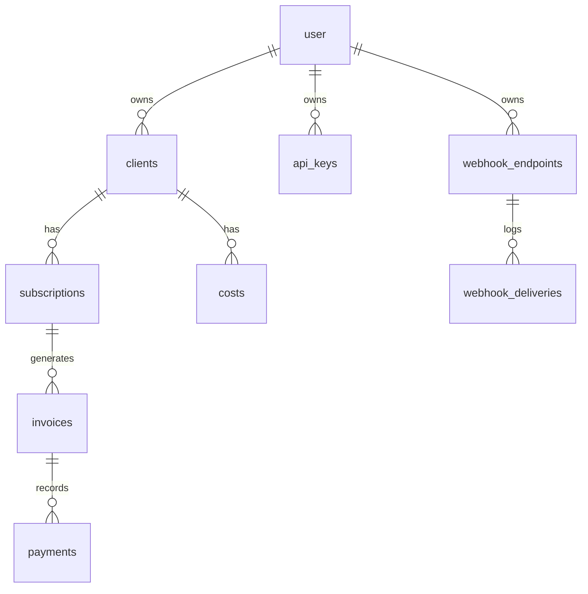

# Phase 3 — Core schema (domain)

**Scope in [ROADMAP.md](c:\myCode\infreetracker\inf-freetracker\ROADMAP.md):** microphases **3.1–3.7** (schema only; no CRUD UI or v1 API in this phase).

**Current state:** `[db/schema/index.ts](c:\myCode\infreetracker\inf-freetracker\db\schema\index.ts)` exports only auth; `[db/schema/auth.ts](c:\myCode\infreetracker\inf-freetracker\db\schema\auth.ts)` defines `user` with `text` PK. Migrations live under `[drizzle/](c:\myCode\infreetracker\inf-freetracker\drizzle)` via `[drizzle.config.ts](c:\myCode\infreetracker\inf-freetracker\drizzle.config.ts)` (`schema: ./db/schema/index.ts`).

---

## 1. Add a domain schema module and wire exports

- Add `**db/schema/domain.ts**` (single file is enough for MVP; split later if it grows) defining:
  - `**pgEnum**` (or Drizzle `pgEnum`) for: currency (`DOP` | `USD`), subscription `billing_cycle`, subscription `status`, invoice `status`, cost `category`, and any fixed `payment.method` values you want in DB (rest can stay `text` if you prefer flexibility).
  - **Primary keys:** use `uuid` + `defaultRandom()` for domain rows unless you explicitly want `text` IDs everywhere; keep `**user_id` as `text` referencing `user.id` (same as session/account).
- `**db/schema/index.ts`:** `export * from "./domain"` and export `**InferSelectModel`/`InferInsertModel`** types for each table (same pattern as `UserRow` today).
- `**auth.ts` relations (optional but useful): extend `userRelations` with `many()` for domain tables, and define `relations()` on new tables for Drizzle query ergonomics.

---

## 2. Table-by-table implementation notes (maps to ROADMAP ACs)

| Microphase                                         | Table(s)                                                                           | Key implementation choices                                                                                                                                                                                                                                                                                                                                                                                                                                                                                          |
| -------------------------------------------------- | ---------------------------------------------------------------------------------- | ------------------------------------------------------------------------------------------------------------------------------------------------------------------------------------------------------------------------------------------------------------------------------------------------------------------------------------------------------------------------------------------------------------------------------------------------------------------------------------------------------------------- |
| **3.1** `clients`                                  | `id`, `userId`, `name`, `contact`, `externalId`, `notes`, `createdAt`, `updatedAt` | **Unique** on `(userId, externalId)`. **CHECK** on `externalId` matching documented regex (e.g. `^[a-z0-9]+(?:-[a-z0-9]+)*$`). **FK** `userId` → `user.id` with `**onDelete: "restrict"` (or `no action`) so MVP matches “manual cleanup / undefined delete” — document in README or a short comment in schema.                                                                                                                                                                                                     |
| **3.2** `subscriptions`                            | As ROADMAP + enums                                                                 | **FK** `clientId` → `clients.id` (restrict). **CHECK** `gracePeriodDays >= 0`, `amount > 0`. **CHECK** for custom cycle: if `billingCycle = 'custom_days'` then `billingIntervalDays is not null and >= 1`. Duplicate `userId` on row for fast scoping; enforce **app-level** that `subscription.userId === client.userId` on insert/update (DB composite FK `(userId, clientId)` → `(clients.userId, clients.id)` is the clean way to enforce tenant+client alignment).                                            |
| **3.3** `invoices`                                 | As ROADMAP                                                                         | **Index** on `(subscriptionId, dueDate)`. **Composite FK** `(userId, subscriptionId)` → `(subscriptions.userId, subscriptions.id)` so invoice always belongs to the same tenant as the subscription (covers **AC-3.3.1** without triggers).                                                                                                                                                                                                                                                                         |
| **3.4** `payments`                                 | As ROADMAP                                                                         | **MVP:** document **full payment only** in README/ROADMAP note; enforce `**amount = invoice.amount`** in application transactions when recording payment (**AC-3.4.1**). **AC-3.4.2** is application logic (later route/action): same transaction updates invoice `status`/`paidAt` — not only schema, but schema should allow nullable `paidAt` and statuses. Optional: **composite FK `(userId, invoiceId)` → `(invoices.userId, invoices.id)`.                                                                   |
| **3.5** `costs`                                    | As ROADMAP                                                                         | **CHECK** `amount >= 0`. Add **index** suited to “per client per month” listing (e.g. `(userId, clientId, billingMonth)` if you use a single `date`/`timestamp` month column, or `(userId, clientId, periodStart)` depending on whether you model `billing_month` vs `period_start`/`period_end`).                                                                                                                                                                                                                  |
| **3.6** `api_keys`                                 | `keyHash`, `prefix`, `revokedAt`                                                   | **No plaintext key column.** Hashing/verification implementation belongs to a later phase, but schema must support **AC-3.6.1/3.6.2** (hash + revoke timestamp).                                                                                                                                                                                                                                                                                                                                                    |
| **3.7** `webhook_endpoints` + `webhook_deliveries` | As ROADMAP                                                                         | `events` as `**jsonb`** (array of strings). **AC-3.7.1:** validate HTTPS URLs in **application** on create/update (optionally add a **CHECK** using `url ~ '^https://'` for extra guard in prod — be careful with dev `http://localhost`). **AC-3.7.2: **document one approach** in README: outbound signing needs a **reversible** secret — recommend **encrypting** the signing secret at rest (e.g. AES-GCM with a dedicated env key) rather than a one-way hash; store ciphertext + metadata columns as needed. |

---

## 3. Migration workflow (match repo conventions)

- After TypeScript schema is complete, run `**pnpm db:generate` to produce the next SQL file under `drizzle/` and update `drizzle/meta` snapshots (same flow as existing `0000\__.sql`).
- Run `**pnpm db:migrate` against a dev database and confirm a clean apply on top of existing auth tables.
- Optionally add `**scripts/verify-phase3.ts` mirroring `[scripts/verify-phase1.ts](c:\myCode\infreetracker\inf-freetracker\scripts\verify-phase1.ts)`: connect, smoke-check tables/constraints exist — not required by ROADMAP but low effort regression guard.

---

## 4. Documentation touch-ups (minimal)

- **README** (or ROADMAP checklist): one short subsection for `**external_id` regex**, **user delete = manual cleanup**, **MVP full payment only**, **webhook secret storage choice**, and **HTTPS webhook URLs in production.
- **ROADMAP.md:** check off **AC-3.x** items as you verify each constraint/index/behavior (schema + documented policies).

---

## 5. Explicitly out of scope for Phase 3

- Client/subscription UI ([section 4+](c:\myCode\infreetracker\inf-freetracker\ROADMAP.md)), API key minting/verification middleware, webhook delivery worker, and payment-recording transactions — those depend on this schema but belong to later phases.

---

## Risk / ordering

- **Dependency order:** create tables in migration order: `clients` → `subscriptions` → `invoices` → `payments`; `costs` after `clients`; `api_keys` / webhooks only need `user`.
- **Better Auth `user` table name:** existing SQL uses quoted `"user"`; FK references in new migration must target that table consistently (Drizzle usually handles this if `references(() => user.id)` is used).
