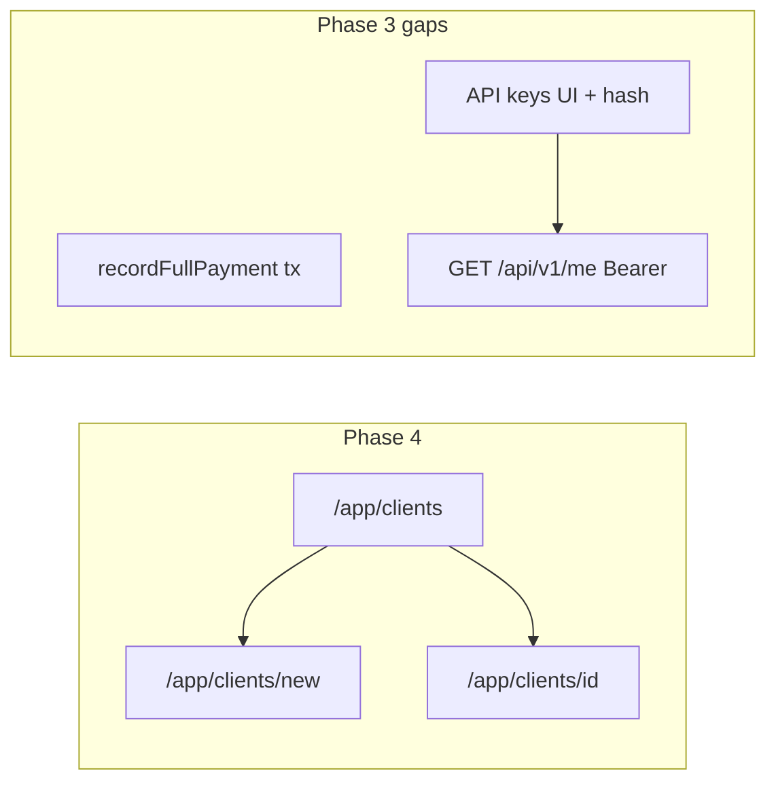

# Phase 3 gaps + Phase 4 (clients)

## Current baseline

- Domain tables and constraints are in place (`[db/schema/domain.ts](c:\myCode\infreetracker\inf-freetracker\db\schema\domain.ts)`); Phase 3 plan explicitly scoped out runtime behavior (`[.cursor/plans/phase_3_domain_schema_598df72c.plan.md](c:\myCode\infreetracker\inf-freetracker.cursor\plans\phase_3_domain_schema_598df72c.plan.md)`).
- Dashboard auth uses layout guard + `[getSession()](c:\myCode\infreetracker\inf-freetracker\lib\session.ts)`; **no** `[middleware.ts](c:\myCode\infreetracker\inf-freetracker)` / `proxy.ts` (fine for this work).
- UI primitives are minimal (`[components/ui/*](c:\myCode\infreetracker\inf-freetracker\components\ui)`): button, card, input, label — Phase 4 will need more shadcn pieces.
- No `zod` in `[package.json](c:\myCode\infreetracker\inf-freetracker\package.json)` yet; add it for server-side validation (matches project TS style).

---

## Phase 3 — close remaining ACs

### AC-3.4.2 — Payment + invoice in one transaction

- Add a **single canonical function** (e.g. `[lib/domain/record-full-payment.ts](c:\myCode\infreetracker\inf-freetracker\lib\domain\record-full-payment.ts)` or under `lib/payments/`) that runs `db.transaction`:
  - Load invoice by `id` + `userId`; require status `pending` or `overdue` (align with future §7.1).
  - Require payment `amount` equals invoice `amount` (numeric/string compare via decimal-safe path).
  - `insert` into `payments`; `update` invoice `status = 'paid'`, `paid_at = now()`.
- **Proof / regression:** extend `[scripts/verify-phase3.ts](c:\myCode\infreetracker\inf-freetracker\scripts\verify-phase3.ts)` with an optional seeded-path test (create minimal rows, call helper, assert invoice paid) **or** a small dedicated `scripts/verify-phase3-payment-tx.ts` to avoid cluttering the main script — pick one approach and document in script header.
- Tick **AC-3.4.2** in `[ROADMAP.md](c:\myCode\infreetracker\inf-freetracker\ROADMAP.md)` once the helper exists and is verified.

### AC-3.6.1 / AC-3.6.2 — API keys (mint once, verify hash, revoked → 401)

- **Hashing:** implement with **Node `crypto`** only (e.g. `scrypt` or `pbkdf2`), storing a single opaque string in `api_keys.key_hash` that includes salt + params (no new npm dependency).
- **Optional pepper:** read `API_KEY_PEPPER` from env in `[lib/env.ts](c:\myCode\infreetracker\inf-freetracker\lib\env.ts)` if set; document in README next to other secrets.
- **Dashboard (minimal, satisfies “plain key shown once”):**
  - New route e.g. `[app/app/settings/api-keys/page.tsx](c:\myCode\infreetracker\inf-freetracker\app\app\settings\api-keys\page.tsx)` (or `/app/api-keys`) listing keys by `prefix` + `createdAt` + revoked state.
  - Server action `createApiKey`: session required, insert row with hash + prefix (first 8 chars of secret), return **one-time** plaintext to the client (e.g. pass to a client component `useState` banner “copy now”).
  - Server action `revokeApiKey`: session + ownership check, set `revoked_at`.
- **v1 verification:** add e.g. `[app/api/v1/me/route.ts](c:\myCode\infreetracker\inf-freetracker\app\api\v1\me\route.ts)` (`runtime: "nodejs"`) that:
  - Parses `Authorization: Bearer <token>`.
  - Looks up candidate keys by `prefix` (derive prefix from token), verify hash, ensure `revoked_at` is null.
  - Returns `401 { "error": "unauthorized" }` for missing/invalid/revoked; `200` with minimal JSON (e.g. `{ "userId" }`) on success.
- This **overlaps** future §12.1; extract shared helper e.g. `lib/api-keys/verify-bearer.ts` so later routes reuse it.
- Tick **AC-3.6.1** and **AC-3.6.2** in ROADMAP when mint + verify + revoke behavior is live.

### AC-3.7.1 — HTTPS webhook URL in production

- **What can be done now:** add `[lib/webhooks/validate-endpoint-url.ts](c:\myCode\infreetracker\inf-freetracker\lib\webhooks\validate-endpoint-url.ts)` implementing README rules: **production** → must be `https:`; **development** → allow `http://localhost` / `http://127.0.0.1` (and typical ports). Use `NODE_ENV` and/or `VERCEL_ENV` consistently and document the rule in a one-line comment + README if needed.
- **Why the ROADMAP checkbox stays deferred:** there is **no webhook create/update path** yet (§11.1). Validation only satisfies AC-3.7.1 when it runs **on save**.
- **Roadmap edit:** Under §3.7 or §11.1, add a short note: _AC-3.7.1 — validator implemented in `lib/...`; wire to webhook server actions when §11.1 ships._ Leave **AC-3.7.1** unchecked until the first dashboard save calls the helper (or split into sub-bullets if you prefer clarity).

---

## Phase 4 — Clients (UI + server actions)

### Data access and security

- Use `[db](c:\myCode\infreetracker\inf-freetracker\db\index.ts)` + Drizzle `eq` / `and` with `**userId = session.user.id` on every query/mutation.
- **Server Actions** in a colocated file e.g. `[app/app/clients/actions.ts](c:\myCode\infreetracker\inf-freetracker\app\app\clients\actions.ts)` (`"use server"`): **re-validate session inside each action** (same pattern as auth-sensitive code; do not rely only on layout).
- Return structured errors `{ fieldErrors?, formError? }` for forms; use `redirect` after successful create.

### Routes and AC mapping

| Area                   | Route / behavior                                                                                        | ROADMAP ACs                                                               |
| ---------------------- | ------------------------------------------------------------------------------------------------------- | ------------------------------------------------------------------------- |
| List                   | `[app/app/clients/page.tsx](c:\myCode\infreetracker\inf-freetracker\app\app\clients\page.tsx)`          | 4.1.1–4.1.2; optional 4.1.3 via client-side name filter or `searchParams` |
| Create                 | `[app/app/clients/new/page.tsx](c:\myCode\infreetracker\inf-freetracker\app\app\clients\new\page.tsx)`  | 4.2.1–4.2.3                                                               |
| Detail / edit / delete | `[app/app/clients/[id]/page.tsx](c:\myCode\infreetracker\inf-freetracker\app\app\clients[id]\page.tsx)` | 4.3.1–4.3.3                                                               |

- **4.2.1 / validation:** Zod schema matching DB rule: lowercase `external_id`, regex `^[a-z0-9]+(?:-[a-z0-9]+)*$` (same as `[clients` check constraint](c:\myCode\infreetracker\inf-freetracker\db\schema\domain.ts)).
- **4.2.2:** `select` existing client by `(userId, externalId)` before insert; return field error instead of relying on DB unique violation (still safe if race — catch unique violation as fallback).
- **4.2.3:** `redirect` to `/app/clients/[id]` (or list) + toast — add **Sonner** via shadcn (`npx shadcn@latest add sonner`) and `<Toaster />` in `[app/layout.tsx](c:\myCode\infreetracker\inf-freetracker\app\layout.tsx)` or app layout.
- **4.3.1:** Edit form: `external_id` **read-only** (disabled input or omitted).
- **4.3.2 / 4.3.3:** Before delete, `count`/`exists` on `subscriptions` for this `clientId` scoped by `userId`. If any exist, return error (recommended MVP: **block on any subscription row** since there is no `cancelled` state yet). Otherwise delete client row.

### UI / design system

- Add shadcn components as needed (follow `[shadcn` skill](c:\myCode\infreetracker\inf-freetracker.agents\skills\shadcn\SKILL.md)): e.g. **table**, **textarea**, **dialog** or **alert-dialog** (delete confirm), **badge** (optional), **sonner**.
- Update `[app/app/layout.tsx](c:\myCode\infreetracker\inf-freetracker\app\app\layout.tsx)` header with nav links: **Dashboard**, **Clients**, **API keys** (so new Phase 3 UI is reachable).

### Next.js 16 details

- Dynamic segment `[[id]](c:\myCode\infreetracker\inf-freetracker\app\app\clients)`: type `params` as `Promise<{ id: string }>` and `await params` ([async params pattern](c:\myCode\infreetracker\inf-freetracker.agents\skills\next-best-practices\async-patterns.md)).
- Use `notFound()` when UUID unknown or row not owned by user.

### ROADMAP

- After QA, mark **AC-4.1.x**, **AC-4.2.x**, **AC-4.3.x** checkboxes in `[ROADMAP.md](c:\myCode\infreetracker\inf-freetracker\ROADMAP.md)`.

---

## Verification

- `pnpm typecheck` and `pnpm lint`.
- Manual: register user → create client → edit → attempt delete with/without subscription (subscription row can be inserted via DB or a temporary script if subscription UI is missing).
- API key: create key, call `GET /api/v1/me` with Bearer, revoke, expect 401.

---

## Explicit non-goals (avoid scope creep)

- §5–§7 subscription/invoice UI, §11 webhook CRUD, §12 full v1 surface (only minimal `/api/v1/me` for Phase 3 ACs).
- Changing Phase 3 schema unless a bug is discovered during implementation.
