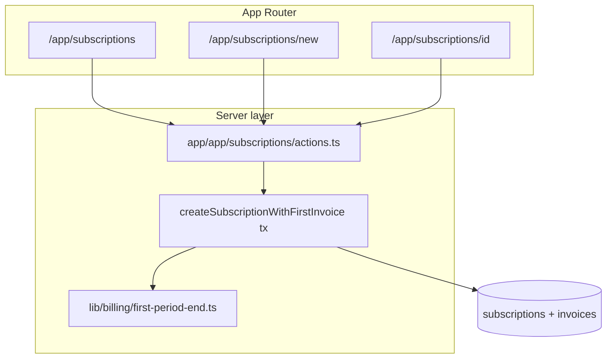

# Phase 5 — Subscriptions (UI + logic)

## Scope (from [ROADMAP.md](c:\myCode\infreetracker\inf-freetracker\ROADMAP.md) §5)

| Microphase        | Acceptance criteria                                                                                                                                                                       |
| ----------------- | ----------------------------------------------------------------------------------------------------------------------------------------------------------------------------------------- |
| 5.1 Create        | AC-5.1.1 client picker scoped to owner; AC-5.1.2 first invoice with `due_date` = first period end; AC-5.1.3 initial `status` `active`                                                     |
| 5.2 List / detail | AC-5.2.1 detail shows client, amount, currency, cycle, grace, status badge; AC-5.2.2 invoices chronological                                                                               |
| 5.3 Edit (MVP)    | AC-5.3.1 amount change affects **next** generated invoice only (document: do not rewrite existing pending rows); AC-5.3.2 grace change applies to future enforcement only (no backdating) |

**Explicit boundary with §6:** Phase 6 adds the **idempotent** period generator, cron, and “generate now.” Phase 5 only needs **correct first-period math + one insert path** so create-subscription satisfies AC-5.1.2 and seeds the same rules §6.1.1–6.1.2 will extend.

---

## Architecture

---

## 1. First period end (pure functions)

Add a small, testable module, e.g. [lib/billing/first-period-end.ts](c:\myCode\infreetracker\inf-freetracker\lib\billing\first-period-end.ts) (name can match repo taste), with **no DB access**:

- **Inputs:** `startDate` as calendar date (`YYYY-MM-DD`), `billingCycle` (`monthly` | `custom_days`), `billingIntervalDays` (required when `custom_days`).
- **Outputs:** `firstPeriodEndDate` (same string format for Drizzle `date` columns) and a `Date` for `subscriptions.current_period_end` (UTC midnight of that end date is acceptable if documented—align with how [scripts/verify-phase3-payment-tx.ts](c:\myCode\infreetracker\inf-freetracker\scripts\verify-phase3-payment-tx.ts) and schema already treat timestamps).
- **Rules (match roadmap intent for §6.1):**
  - **custom_days:** first period end = `startDate + N` calendar days (define whether N is “duration of period” vs “due offset”; pick one, document in a one-line comment—simplest MVP: due at `start + N days`).
  - **monthly:** advance one calendar month from `startDate`, **same day-of-month**; **month-end clamp** (e.g. Jan 31 → Feb 28/29) documented in code comment + short note in ROADMAP §17 or next to §6.1 when ticking later.

These functions become the shared core Phase 6 imports for “next period” (Phase 5 only calls them for the **first** period).

---

## 2. Transactional create (AC-5.1.2, AC-5.1.3)

Add e.g. [lib/domain/create-subscription-with-first-invoice.ts](c:\myCode\infreetracker\inf-freetracker\lib\domain\create-subscription-with-first-invoice.ts):

- `db.transaction`: verify `client` exists and `clients.user_id === session user`.
- `insert` into `subscriptions` with:
  - `status: "active"`, `blockedAt: null`
  - `amount`, `currency`, `billingCycle`, `billingIntervalDays`, `startDate`, `gracePeriodDays` from validated input
  - `currentPeriodEnd` from period helper
- `insert` into `invoices`: same `amount`/`currency`, `dueDate` = `firstPeriodEndDate`, `status: "pending"`, `userId` and `subscriptionId` consistent with composite FKs in [db/schema/domain.ts](c:\myCode\infreetracker\inf-freetracker\db\schema\domain.ts).

Return `subscriptionId` for redirect. On failure, surface structured errors like [app/app/clients/actions.ts](c:\myCode\infreetracker\inf-freetracker\app\app\clients\actions.ts).

**AC-5.1.3:** With no pre-existing invoices at create time, `active` is correct; document that enforcement (§10) may change status later.

---

## 3. Validation

Add [lib/validation/subscriptions.ts](c:\myCode\infreetracker\inf-freetracker\lib\validation\subscriptions.ts):

- **Create:** `clientId` (uuid), `amount` (positive decimal string/number normalized to DB scale), `currency` enum, `billingCycle`, conditional `billingIntervalDays`, `startDate`, `gracePeriodDays` (integer ≥ 0)—mirror DB checks in `subscriptions` table.
- **Update (MVP):** `subscriptionId` + editable `amount`, `gracePeriodDays`; optionally `billingIntervalDays` only when cycle is `custom_days`. **Immutability:** `clientId` and `startDate` not editable in MVP (document on form)—avoids breaking period semantics before §6 ships.

---

## 4. Server actions + routes

- New colocated [app/app/subscriptions/actions.ts](c:\myCode\infreetracker\inf-freetracker\app\subscriptions\actions.ts) — follow `"use server"` + `auth.api.getSession({ headers: await headers() })` per clients pattern.
- **create:** call transactional helper; `redirect` to detail; toast via existing Sonner pattern from client forms.
- **update:** `update` subscription row scoped by `userId`; **do not** touch existing invoice amounts (AC-5.3.1).
- **list/detail reads:** `where(eq(subscriptions.userId, …))`; join `clients` for names; invoices `orderBy` `dueDate` asc (or `createdAt` if tie-break needed).

**Pages (mirror clients layout):**

- [app/app/subscriptions/page.tsx](c:\myCode\infreetracker\inf-freetracker\app\app\subscriptions\page.tsx) — table or card list, empty state + CTA, link to client
- [app/app/subscriptions/new/page.tsx](c:\myCode\infreetracker\inf-freetracker\app\app\subscriptions\new\page.tsx) — form
- [app/app/subscriptions/[id]/page.tsx](c:\myCode\infreetracker\inf-freetracker\app\app\subscriptions[id]\page.tsx) — async `params: Promise<{ id: string }>`, `notFound()` if missing/unowned

**AC-5.1.1:** Load clients with `select` filtered by `userId` only; client `<Select>` (or native select) with no cross-tenant leakage.

---

## 5. UI components and shadcn

- Add **Select** (and **Form** if you want consistent patterns) via shadcn—currently missing under [components/ui](c:\myCode\infreetracker\inf-freetracker\components\ui); clients forms use raw inputs.
- Reuse **Table**, **Badge**, **Card**, **Button**, **Input**, **Label** as in [components/clients](c:\myCode\infreetracker\inf-freetracker\components\clients).
- Status badge mapping: `active` | `grace` | `overdue` | `blocked` from [subscriptionStatusEnum](c:\myCode\infreetracker\inf-freetracker\db\schema\domain.ts).

---

## 6. Navigation

Update [app/app/layout.tsx](c:\myCode\infreetracker\inf-freetracker\app\app\layout.tsx) with a **Subscriptions** nav link between Clients and API keys (or after Dashboard).

Optional: add a secondary link on [app/app/page.tsx](c:\myCode\infreetracker\inf-freetracker\app\app\page.tsx) next to Clients.

---

## 7. Verification (no new test framework required unless you prefer it)

- `pnpm typecheck` / `pnpm lint`.
- **Manual:** create client → create subscription → assert one `pending` invoice, `due_date` matches expected for monthly and custom_days (include a Jan 31 case once).
- **Optional script:** `scripts/verify-phase5-subscription-create.ts` (pattern from [scripts/verify-phase3-payment-tx.ts](c:\myCode\infreetracker\inf-freetracker\scripts\verify-phase3-payment-tx.ts)) that calls the domain helper and asserts invoice row—keeps period math honest without adding Vitest.

After QA, check **AC-5.1.x–5.3.x** in [ROADMAP.md](c:\myCode\infreetracker\inf-freetracker\ROADMAP.md).

---

## Non-goals (defer to later phases)

- §6 cron / idempotent multi-period generation / unique “one invoice per period” constraint (may land in Phase 6).
- §7 pay invoice UI (detail page can link forward as “coming soon” or omit).
- §10 enforcement / status auto-transitions (status may remain `active` until cron exists unless you add a manual “recompute” later).
- Changing **past** invoice lines when editing subscription amount (explicitly out of scope per AC-5.3.1).
