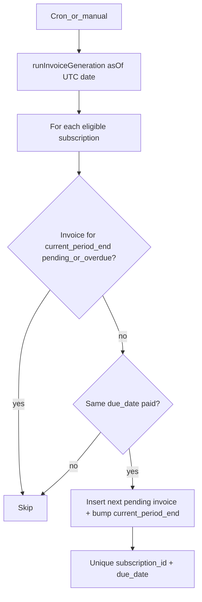

# Phase 6 — Invoice generation (ROADMAP §6)

## Scope and boundaries

- **In scope:** §6.1 (idempotent generator), §6.2 (manual generate + last-generated display), §6.3 (daily cron + auth).
- **Explicitly out of scope:** §7 payment UI, §10 enforcement cron (status may still be mostly manual until Phase 10; generator only **creates** `pending` rows).
- **Handoff from Phase 5:** Extend `[lib/billing/first-period-end.ts](lib/billing/first-period-end.ts)` (or a sibling module) so “next period end” = same rules as first period but anchored on **previous period end** (`addCalendarMonths(prev, 1)` / `addCalendarDays(prev, N)`). That satisfies AC-6.1.1–6.1.2 and matches how `[computeFirstPeriodEnd](lib/billing/first-period-end.ts)` already implements month-end clamping.

## Domain rules (to implement and briefly document in code comments)

**Eligibility (AC-6.3.1):** Process subscriptions with `status` in `active`, `grace`, `overdue`. **Skip `blocked`** — no new invoices while blocked (note in generator module header).

**When to create the next invoice:** Treat `subscriptions.current_period_end` as the due date of the subscription’s **current billing frontier** (already true after `[createSubscriptionWithFirstInvoice](lib/domain/create-subscription-with-first-invoice.ts)`).

1. Load the invoice for this subscription with `due_date` equal to the UTC calendar date of `current_period_end` (normalize timestamp → `YYYY-MM-DD` like `[formatPgDate](app/app/subscriptions/actions.ts)`).
2. If that invoice exists and `status` is `pending` or `overdue` → **no-op** (open obligation for this period; AC-6.1.3).
3. If that invoice exists and `status` is `paid` → compute `nextDue = advancePeriod(current_period_end_date)`, insert a new `pending` invoice (`amount` / `currency` from **current** subscription row per AC-5.3.1), then `UPDATE subscriptions SET current_period_end = UTC midnight(nextDue)`.
4. If no invoice row exists for that due date (data inconsistency / legacy) → define a small **repair** branch (e.g. insert missing row or realign) or fail safe; keep it minimal and covered by a test if you add it.

**Idempotency (AC-6.1.3):** Add a **unique index** on `(subscription_id, due_date)` in `[db/schema/domain.ts](db/schema/domain.ts)` + new Drizzle migration. Concurrent cron runs then dedupe at the DB: wrap insert in a transaction and treat unique violation as success (or use an equivalent “on conflict do nothing” pattern with Drizzle).

## File-level implementation sketch

| Area         | Action                                                                                                                                                                                                                                                                                                                                                                                                                                                                                                         |
| ------------ | -------------------------------------------------------------------------------------------------------------------------------------------------------------------------------------------------------------------------------------------------------------------------------------------------------------------------------------------------------------------------------------------------------------------------------------------------------------------------------------------------------------- |
| Billing math | Add `computeNextPeriodEnd({ periodEndDate, billingCycle, billingIntervalDays })` (or refactor shared `advance` used by `computeFirstPeriodEnd`) in `[lib/billing/first-period-end.ts](lib/billing/first-period-end.ts)`. Unit-test month-end chains and custom N-day chains.                                                                                                                                                                                                                                   |
| Domain       | New `lib/domain/generate-next-invoice.ts` (name as you prefer): **one subscription**, `asOf` date param, uses `db.transaction`, enforces `user_id` scoping if called with subscription id only (join or pre-check).                                                                                                                                                                                                                                                                                            |
| Job runner   | New `lib/jobs/run-invoice-generation.ts`: query eligible subscriptions (filter statuses, exclude blocked), call domain helper per row; accept `asOf` for tests.                                                                                                                                                                                                                                                                                                                                                |
| HTTP cron    | New Route Handler e.g. `[app/api/cron/invoices/route.ts](app/api/cron/invoices/route.ts)` (or `app/api/jobs/...`): `force-dynamic`, verify **shared secret** header (e.g. `Authorization: Bearer <CRON_SECRET>`) per AC-6.3.2. Optionally allow Vercel’s cron verification if you deploy there (document which header/env is authoritative).                                                                                                                                                                   |
| Vercel       | Add root `[vercel.json](vercel.json)` with `crons` entry pointing at the new path (daily). Repo currently has **no** `vercel.json`.                                                                                                                                                                                                                                                                                                                                                                            |
| Env          | Extend `[.env.example](.env.example)` with `CRON_SECRET=...`.                                                                                                                                                                                                                                                                                                                                                                                                                                                  |
| UI §6.2      | On `[app/app/subscriptions/[id]/page.tsx](app/app/subscriptions/[id]/page.tsx)`: show **last generated** timestamp (max `invoices.created_at` for that subscription — extend `[getSubscriptionForSession](app/app/subscriptions/actions.ts)` / `SubscriptionInvoiceRow` to include `createdAt` or a derived `lastInvoiceCreatedAt`). Add **Generate now** control (server action in `actions.ts` or small client form) that calls the **same** job helper as cron for a **single** subscription id (AC-6.2.1). |
| Verification | New script under `scripts/` (pattern: `[scripts/verify-phase5-subscription-create.ts](scripts/verify-phase5-subscription-create.ts)`): create sub + pay first invoice via `[recordFullPaymentInTransaction](lib/domain/record-full-payment.ts)`, run generator twice, assert exactly one new invoice and stable `current_period_end`.                                                                                                                                                                          |

## AC checklist mapping

- **AC-6.1.1–6.1.2:** Covered by shared advance math + tests (same semantics as Phase 5).
- **AC-6.1.3:** Unique constraint + double-run test/script.
- **AC-6.2.1:** Single entrypoint module used by cron route and server action.
- **AC-6.2.2:** Expose `created_at` (or aggregate) on subscription detail.
- **AC-6.3.1:** Status filter + documented `blocked` exclusion.
- **AC-6.3.2:** Secret (or platform) auth on the route handler.

## Risks / follow-ups (not Phase 6)

- **Catch-up billing:** This plan generates **at most one** new invoice per subscription per run when the current period invoice is paid; multiple missed periods may need multiple daily runs or a later “catch-up loop” (call out in a comment if you keep a single step).
- **Phase 10:** Overdue/blocked transitions remain separate; generator only creates invoices.
