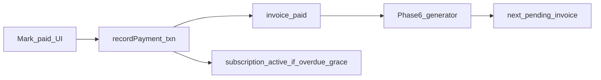

# Phase 7 — Payments (manual) + `payment.received` webhooks

## Relationship to Phase 6 (explicit)

Phase 6 already defines the **next-invoice lifecycle** in `[lib/domain/generate-next-invoice.ts](lib/domain/generate-next-invoice.ts)`: when the invoice whose `due_date` matches `subscriptions.current_period_end` is `**paid`**, the generator may insert the next `pending` invoice and advance `current_period_end`. That path is triggered by `[lib/jobs/run-invoice-generation.ts](lib/jobs/run-invoice-generation.ts)`, `[app/api/cron/invoices/route.ts](app/api/cron/invoices/route.ts)`, and **Generate now on `[app/app/subscriptions/[id]/page.tsx](app/app/subscriptions/[id]/page.tsx)`.

**Phase 7 does not replace Phase 6.** It adds **mark paid** from the UI and subscription **status** cleanup after payment. UX should make the handoff obvious: on the new invoice detail page (or after pay success), short copy that the **next billing period invoice** appears after payment when cron runs or when the user uses **Generate now** on the subscription.

## §7.1 — Mark invoice paid (UI)

**Current state:** `[lib/domain/record-full-payment.ts](lib/domain/record-full-payment.ts)` already enforces AC-7.1.1 (only `pending` / `overdue`) and inserts `payments` + sets invoice `paid` / `paid_at` (AC-3.4.2). It does **not** update `[subscriptions](db/schema/domain.ts)` (AC-7.1.3 gap).

**Plan**

1. **Invoice detail route** — Add `[app/app/invoices/[id]/page.tsx](app/app/invoices/[id]/page.tsx)` (new). Server-load invoice by `id` with strict `user_id` scope; join **subscription** + **client** for context (name, `external_id`, link back to `[/app/subscriptions/[id]](app/app/subscriptions/[id])`).
2. **Server helper** — Add e.g. `getInvoiceForSession(invoiceId)` and `recordInvoicePaymentAction` in a new `[app/app/invoices/actions.ts](app/app/invoices/actions.ts)` (or colocate with subscriptions if you prefer one module; separate keeps invoice concerns clear).
3. **Predefined payment methods** — Add a small Zod schema (e.g. `[lib/validation/payments.ts](lib/validation/payments.ts)`) with a fixed list of methods (strings) for AC-7.1.2; optional `note`. Reject unknown methods before calling the domain layer.
4. **Extend the payment transaction (AC-7.1.3)** — Either extend `[recordFullPaymentInTransaction](lib/domain/record-full-payment.ts)` or add a thin wrapper `recordFullPaymentAndRecalculateSubscription` that, **in the same transaction** after the invoice update:

- Loads the subscription via `invoices.subscription_id` (scoped by `user_id`).
- **Documented MVP rule:** if `subscription.status` is `overdue` or `grace`, set `status = 'active'` (and `updated_at`). Optionally align with future §10.1.2: if `status === 'blocked'`, also allow transition to `active` and clear `blocked_at` when the paid invoice is the blocking obligation — **pick one rule set**, document in a file-level comment, and add a small unit test for the pure transition helper if extracted.

## §7.2.1 — Payment row visible on invoice detail

- Query `[payments](db/schema/domain.ts)` for `invoice_id` (scoped by `user_id`), ordered by `recorded_at` / `created_at`.
- Render a simple table or list on the invoice detail page (method, amount, note, recorded time).

## §7.2.2 — Emit `payment.received` after commit (see §11)

**Current state:** No outbound webhook code; only `[lib/webhooks/validate-endpoint-url.ts](lib/webhooks/validate-endpoint-url.ts)`. README expects webhook `secret` as **ciphertext** and `WEBHOOK_SECRET_ENCRYPTION_KEY`-style decryption at dispatch time — **no encrypt/decrypt utilities exist in repo yet**.

**Plan (minimal §11.2 slice bundled into Phase 7)**

1. **Crypto + env** — Add `getWebhookSecretEncryptionKey()` in `[lib/env.ts](lib/env.ts)` (document in `[.env.example](.env.example)`); implement encrypt/decrypt helpers (e.g. AES-GCM) in `[lib/webhooks/secret-crypto.ts](lib/webhooks/secret-crypto.ts)` for signing material at rest. _Note:_ §11.1 UI will need to **encrypt on save**; until then, manual DB seeds for tests must use ciphertext format the decrypt helper expects, or Phase 7 includes a **minimal** endpoint-create path (see below).
2. **Dispatch** — Add e.g. `[lib/webhooks/dispatch-event.ts](lib/webhooks/dispatch-event.ts)`: for `userId`, load enabled `[webhookEndpoints](db/schema/domain.ts)` whose `events` JSON array includes `payment.received`; build payload matching §11.2.1 shape (`event`, `timestamp`, `data` with invoice id, amounts, client `external_id`, subscription id as needed); compute **HMAC-SHA256** signature (document header name in code comment, e.g. `X-Webhook-Signature`); `fetch` POST **synchronously** (MVP); insert rows into `[webhookDeliveries](db/schema/domain.ts)` with `status` + `last_error` on non-2xx (AC-11.2.3 MVP: log + optional single retry documented in comment).
3. **Call site** — After a **successful** payment transaction, invoke dispatch **outside** the DB transaction (so DB commit is guaranteed first): e.g. from the server action via `void dispatchPaymentReceived(...)` or `after()` from Next if you already use it — avoid blocking the user on slow endpoints if product prefers; ROADMAP allows sync MVP.

**Making AC-7.2.2 testable without raw SQL**

- **Option A (recommended):** Include a **minimal §11.1 subset** in Phase 7: one settings page or section to **create** a webhook endpoint (URL + event checkboxes including `payment.received`) calling `assertValidWebhookEndpointUrl` on save and storing **encrypted** secret from a generated plaintext (shown once). Full “test webhook” button (AC-11.1.2) can remain Phase 11 proper.
- **Option B:** Ship dispatch + crypto only; document that verifying `payment.received` requires seeded endpoints until §11.1.

## Navigation / Phase 6 UX touches

- Update `[components/subscriptions/subscription-invoice-table.tsx](components/subscriptions/subscription-invoice-table.tsx)`: make due date (or a “View” control) link to `/app/invoices/[id]`.
- Invoice detail: breadcrumb or links to client + subscription; short note on **next invoice** and **Generate now** / cron.

## Verification

- Add `scripts/verify-phase7-payments.ts` (or similar): create subscription + invoice (reuse domain create), mark paid via the **same** domain entrypoint the UI will use, assert subscription status transition; optionally hit dispatch with a mock server or skip network and unit-test payload + HMAC in isolation.
- Extend `package.json` with `verify:phase7-...` script.

## Out of scope (later phases)

- §12 `POST /v1/payments` (separate from dashboard).
- Full §11.1 test button, delivery retries, and §10 enforcement cron (overdue/blocked automation) — only touch subscription status on pay as needed for AC-7.1.3.
